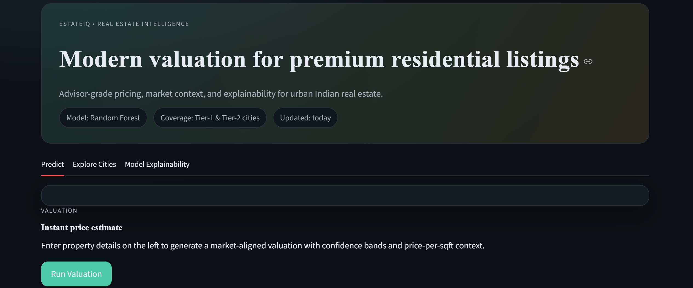
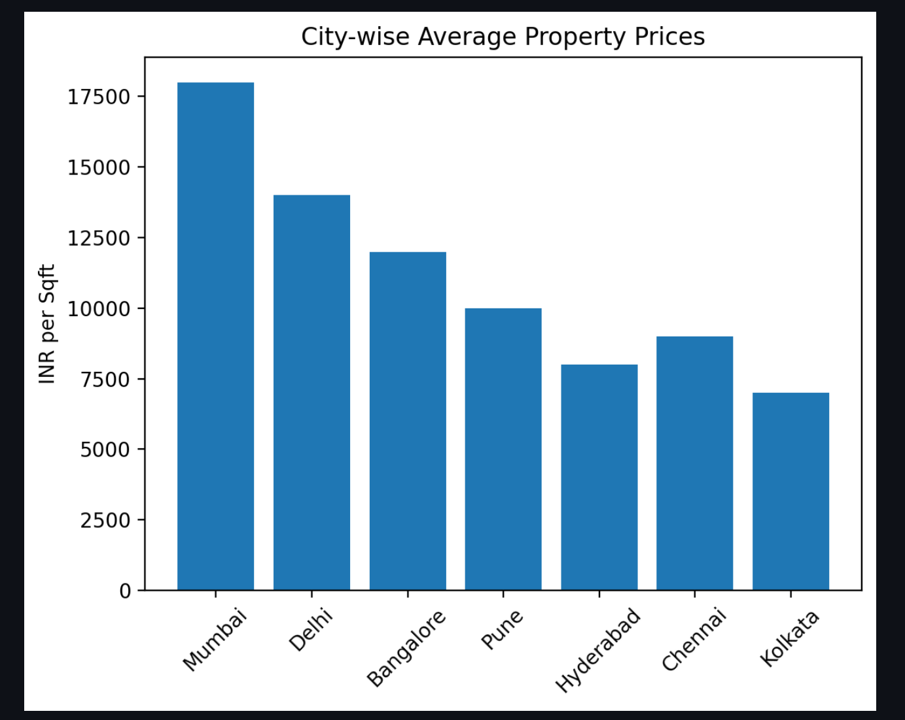
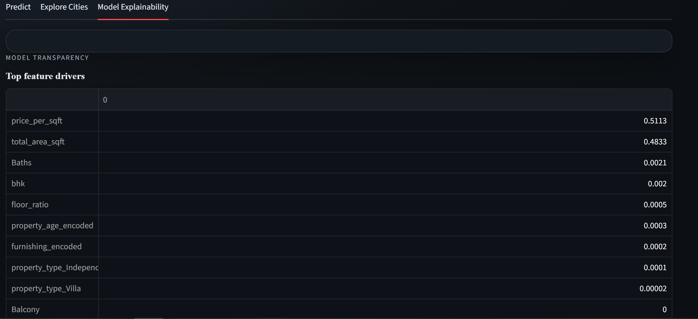
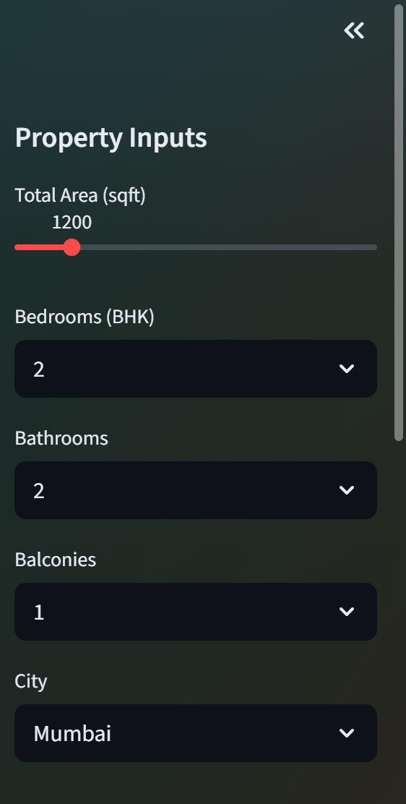
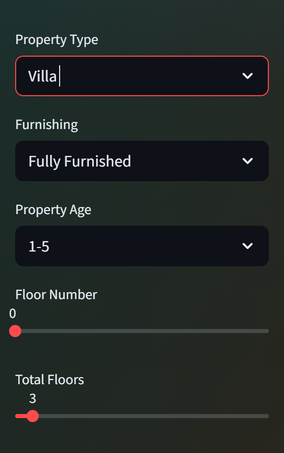
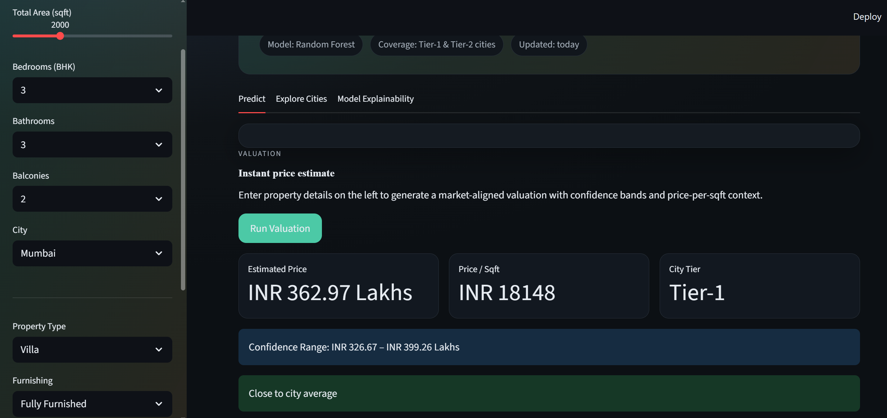

🏡 INTELLIGENT HOUSE PRICE PREDICITION SYSTEM
Advisor-grade real estate valuation for Indian cities

• ⬇️ SCROLL BELOW for LIVE DEMO of this project  •

A modern, end-to-end machine learning system that delivers market-aligned residential property valuations, combining predictive modeling, feature explainability, and interactive city intelligence.

🚀 OVERVIEW

The Intelligent House Price Prediction System is a full-stack ML application designed to estimate residential property prices across Tier-1 and Tier-2 Indian cities.

Unlike basic regression demos, this project delivers:
✔ Advisor-grade predictions
✔ Non-linear ML modeling (Random Forest)
✔ Feature engineering & explainability
✔ Professional UI with what-if analysis
✔ Market context (price/sqft, city tiers)

This project simulates how real real-estate intelligence platforms are built.

🎯 KEY HIGHLIGHTS
🔥 Random Forest Regressor (R² ≈ 0.99)
🧠 Feature-driven predictions (no hardcoded pricing hacks)
📊 City-wise market intelligence & comparisons
🧩 Explainable ML with feature importance
🎨 Premium, modern UI (dashboard-style)
🌍 Multi-city Indian dataset (14k+ properties)

🧠 MACHINE LEARNING ARCHITECTURE

📌 Problem Type
Supervised Regression

📌 Model Selection
   Model:          -    	Reason:
>> Linear          -     Regression	Baseline
>> Random Forest   -     Regressor	Final (handles non-linearity & interactions)

👉 Random Forest significantly outperformed Linear Regression on MAE, RMSE, and R².

📊 Model Performance
   Metric	    -   Value
>> R² Score	  -   0.99
>> RMSE	      -   ~9.7
>> MAE	      -   ~1.5

This indicates excellent generalisation on unseen data.

🧩 FEATURES USED BY THE MODEL

🔹 Core Numerical Features
>> Total Area (sqft)
>> Bedrooms (BHK)
>> Bathrooms
>> Balconies
>> Floor Ratio (floor / total floors)
>> Price per Sqft (derived)

🔹 Encoded Contextual Features
>> City (One-Hot Encoded)
>> Property Type (Apartment / House / Villa)
>> Furnishing Status
>> Property Age (Ordinal Encoding)

🧠 FEATURE INTERPRETABILITY
The system exposes feature importance directly in the UI.

Top drivers typically include:
>> Price per Sqft
>> Total Area
>> City
>> BHK
>> Bathrooms

This allows users to understand why a price was predicted, not just the number.

🖥️ APPLICATION FEATURES

🔹 Predict Tab
>> Instant valuation
>> Confidence bands
>> Price per sqft context
>> City tier classification
>> What-if analysis (interactive inputs)

🔹 Explore Cities
>> City-wise average price visualisation
>> Tier-1 vs Tier-2 comparison
>> Market affordability insights

🔹 Model Explainability
>> Feature importance ranking
>> Transparent ML behaviour
>> Non-black-box modeling

🛠️ TECH STACK

💻 Backend / ML:
>> Python
>> Pandas, NumPy
>> Scikit-learn
>> Random Forest Regressor
>> Joblib (model persistence)

🎨 Frontend:
>> Streamlit
>> Matplotlib
>> Custom modern UI styling

🔥 LIVE DEMO
[🏠 House Price Prediction – Live Demo](https://housepriceprediction-8aneemappd7ojz2jji7j5cm.streamlit.app/)

PROJECT SNAPSHOTS

🔹Title

🔹Bar-graph

🔹Model Interpretability

🔹Property inputs

🔹Property inputs

🔹Example prediction

